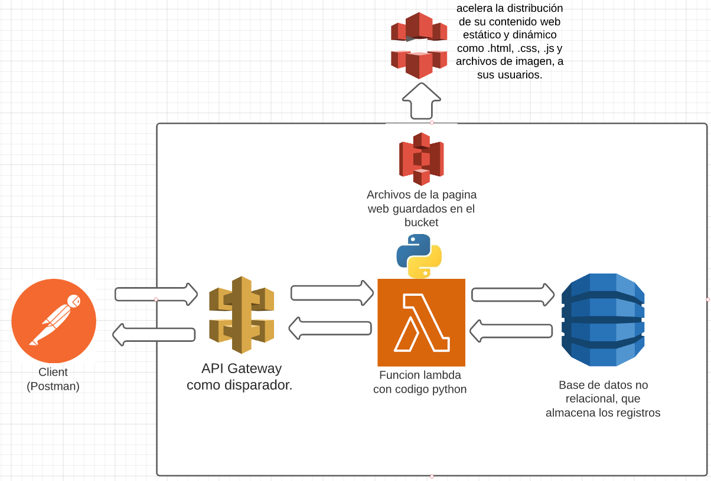

# CRUD_serverless_aws
Mi aplicación es un CRUD que utiliza servicios de AWS Lambda, DynamoDB y API Gateway. El front-end está desarrollado en HTML, CSS y JavaScript y consume el back-end a través de la API.
## Contenidos
1. [Descripción](#Descripción) 
2. [Requisitos](#Requisitos)
3. [Instalación](#Instalación)
3. [Uso](#Uso)
4. [Arquitectura del proyecto](#arquitecturadelproyecto)

## Descripción
Esta aplicación te permite realizar operaciones básicas de gestión de datos en una tabla de DynamoDB, como crear, leer, actualizar y eliminar registros. Además, permite visualizar y filtrar los datos de la tabla mediante una tabla dinámica en el front-end, implementada con la librería DataTables.   

## Requisitos

Para utilizar esta aplicación necesitas:

* Una cuenta de AWS, si no tenes una cuenta podes create una en este enlace [AWS](https://aws.amazon.com/es/?nc2=h_lg)

* Una tabla en DynamoDB con al menos los siguientes campos: idPersona (tipo String), nombre (tipo String), pais (tipo String) y edad (tipo Number).

* Una función Lambda y una API Gateway configuradas para interactuar con la tabla de DynamoDB.

* AWS S3.

* AWS Cloudfront

## Instalación

Para instalar y utilizar esta aplicación sigue los siguientes pasos:

1. Descarga o clona este repositorio en tu entorno de desarrollo.

2. Abre el archivo index.html en tu navegador para ver el front-end de la aplicación.

3. Sube el archivo lambda_function.py a tu función Lambda en AWS Lambda.

4. Crea un bucket S3 y sube tus archivos de la aplicación web al bucket.

5. Crea una distribución Cloudfront y selecciona tu bucket S3 como origen.

6. Configura el dominio personalizado para tu distribución Cloudfront siguiendo las instrucciones de AWS.

7. Accede a tu aplicación web a través del dominio personalizado que has configurado.

## Uso
Una vez instalado el proyecto, podrás acceder a la aplicación web a través del dominio personalizado que has configurado en Cloudfront. La aplicación estará disponible para cualquier usuario que tenga acceso a Internet.

1. Haz clic en el botón "Nuevo" para agregar un nuevo registro a la tabla
2. Ingresa los datos del nuevo registro y haz clic en "Guardar"
3. Verás que el nuevo registro se agrega a la tabla y también se guarda en la base de datos de DynamoDB
4. Haz clic en el botón "Editar" para modificar el usuario y ingresa los datos que quieres cambiar
5. haz clic en el boton "Eliminar" para eliminar el usuario

## Arquitectura del proyecto

Explicacion de la arquitectura:

* Postman para hacer peticiones a la api.
* Api gateway es el activador de la funcion lambda
* La funcion lambda verifica que tipo de metodo hizo el cliente, y ejecuta una funcion en base a la peticion que hizo el cliente, y almacena los resultados a dynamodb.
* Bucket de s3 donde almaceno los archivos de mi pagina web.
* Cloudfront consume esos archivos que estan en el bucket, y luego despliega la pagina web.
